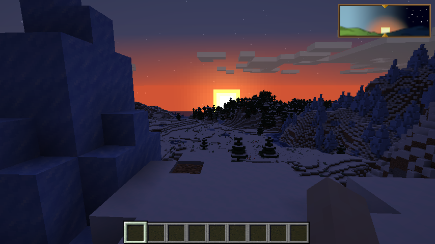

<p align="center">
    
<p align="center">
    <a href="https://jitpack.io/#yooksi/daylight">
        
    </a>
    <a href="https://curse.nikky.moe/api/url/384362">
		
	</a>
    <a href="https://www.gnu.org/licenses/">
        
    </a>
    <a href="https://discord.gg/dKY9xW">
        
    </a>
</p>

## About

Daylight is a Minecraft Forge mod that serves as a precise and flexible visual indicator of current game time.

Time management is one of many problems survival players face. Not knowing the precise time of day makes it difficult to do your daily tasks. The clock item was introduced to mitigate this problem, however its design leaves much to be desired. This is where Daylight swoops in to save the day!

Once installed Daylight will be visible in the corner of your screen *(position is configurable)* from where it will continually inform you on what time of day it is with seamless and graceful animation.

With the power of Daylight you are guaranteed to always be one step ahead of time!

## Features

- Keep track of time without having to look at the sky or craft the clock item.
- Daytime cycle plays a seamless animation located in the corner of your screen.
- Shows different textures for different biome types such as *plains, desert, snow etc.*
- Fully configurable GUI position relative to defined orientation.

## Screenshots

<p float="left">
    
</p>
<p float="left">
    <a href="https://raw.githubusercontent.com/yooksi/daylight/readme/assets/screenshots/sunrise.png" target="_blank">
        
    </a>
    <a href="https://raw.githubusercontent.com/yooksi/daylight/readme/assets/screenshots/noon.png" target="_blank">
        
    </a>
    <a href="https://raw.githubusercontent.com/yooksi/daylight/readme/assets/screenshots/day_1.png" target="_blank">
        
    </a>
    <a href="https://raw.githubusercontent.com/yooksi/daylight/readme/assets/screenshots/day_2.png" target="_blank">
        
    </a>
</p>
<p float="left">
    <a href="https://raw.githubusercontent.com/yooksi/daylight/readme/assets/screenshots/sunset.png" target="_blank">
        
    </a>
    <a href="https://raw.githubusercontent.com/yooksi/daylight/readme/assets/screenshots/midnight.png" target="_blank">
        
    </a>
    <a href="https://raw.githubusercontent.com/yooksi/daylight/readme/assets/screenshots/night.png" target="_blank">
        
    </a>
    <a href="https://raw.githubusercontent.com/yooksi/daylight/readme/assets/screenshots/mining.png" target="_blank">
        
    </a>
</p>


## Installation

### Where to get it?

This depends on what you want to use the mod for.

- The **recommended** way of obtaining the mod is to download it from [CurseForge](https://www.curseforge.com/minecraft/mc-mods/daylight).
- Developers who want to use the mod in dev environment should read [For Developers](#for-developers) section.

The mod can always be downloaded from the [releases](https://github.com/yooksi/daylight/releases) section of the repository.

### How to install it?

- Install like any other mod by placing the jar in `mods` directory.
- Install CocoLib as instructed in [Dependencies](#dependencies) section.

### Dependencies

Daylight depends on [CocoLib](https://www.curseforge.com/minecraft/mc-mods/cocolib) to handle technical stuff like positioning and drawing GUI elements on screen and a few other things. If you are using the Twitch desktop application CocoLib will be automatically downloaded, otherwise you will have to download it manually.

Head over to [Files](https://www.curseforge.com/minecraft/mc-mods/cocolib/files) section of the CocoLib mod library page and download the **latest** version.

### Configuration

Find the mod configuration file in`config/daylight-client.toml`

Here is a list of currently available configuration options:

- Choose where you want Daylight GUI on your game screen:

  ```toml
  #Allowed Values: TOP_LEFT, TOP_RIGHT, TOP_CENTER, BOTTOM_LEFT, BOTTOM_RIGHT
  guiAlignment = "TOP_LEFT"
  ```

-  Defines Daylight GUI offset from edge of main window screen:
  ```toml
  #Format: [ <offsetX>, <offsetY> ] (i.e. [ 5, 5 ])
  guiOffset = "[ 5, 5 ]"
  ```

## For developers

Use gradle to obtain the mod from [Jitpack](https://jitpack.io/#yooksi/daylight) like this:

```groovy
repositories {
	...
	maven { url 'https://jitpack.io' }
}
dependencies {
    implementation fg.deobf('com.github.yooksi:daylight:Tag')
}
```

This will resolve the desired version of the mod from Jitpack.
Replace `Tag` with the version, commit or branch you with to obtain.

### Testing

- Use the `timecycle` command from [TimeLib](https://github.com/yooksi/timelib) to speed up day/night cycle.
  *See [commands](https://github.com/yooksi/timelib#commands) section of TimeLib documentation for more information.*

## License

This project is licensed under [General Public License v3.0](https://www.gnu.org/licenses).

Software that depends on, is built upon or derived from this project is conditioned on making available complete source code of licensed works and modifications, which include larger works using a licensed work, under the same license. Copyright and license notices must be preserved.

